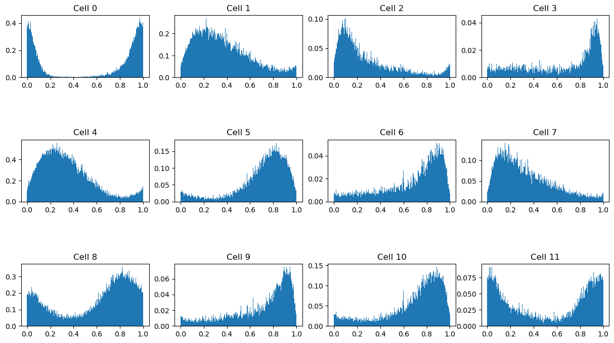
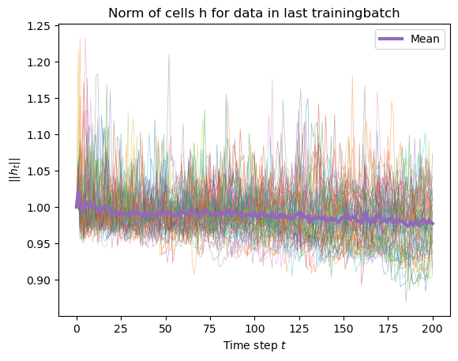
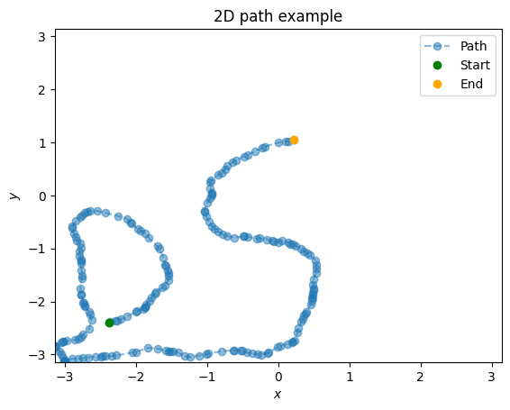

## Introduction

(Cueva and Wei, 2018)

---
## First model
- RNN, 100 cells
- Input: 1D speeds
- Desired output (decoder): 1D positions
- Random positive speeds

---
### Results

- Accurate and robust, but not energy efficient

---
## Second model: Mini-model
- RNN, 2 cells
- Input: 1D speeds
- Desired output (without decoder): 1D positions mapped on 2D unit circle
- Random positive speeds

---
### Results

- Rotation matrix: energy efficient, but neither accurate nor robust

---
## Third model: With regularization
- RNN, 100 cells
- Input: 1D speeds
- Desired output (decoder): 1D positions
- Random positive speeds
- *L2 regularization* on the vector norm of cell activity

---
### Results

- Robust and accurate, but not energy efficient
---
## Fourth model: Arccos-loss
- RNN, 100 cells
- Input: 1D speeds
- Output: *relative* 1D positions decoded from relative 100D vector angles with arccos
- Random positive speeds

---
### Results

- 93 % explained variance

---

- x-axis: position (scaled down from 0 to 2pi, to 0 to 1), y-axis: cell activity

---

---

---

---
- In other words: robust, accurate and energy efficient

---
# Navigation in 2D

---

---
## Comparison model
- RNN, 288 cells
- Input: 2D speeds
- Output (decoder): 2D positions
- No regularization

---
### Result

---

- 87 % explained variance

---
- In other words: good accuracy and robustness, but bad energy efficiency

---
## Trivial expansion
- Two instances of 1D arccos model, one for x and one for y axis

---
### Results

---

---
### Weaknesses
- Doesn't make sense with hexagonal grid cells
- Only one frequency
- Restrictive

---
## Low et al.
- RNN, 256 cells
- Input: 2D speeds
- Output (decoder): sin and cos of x and y positions (4 values)

---
### Results

---

---

---

---

---

---
### Comments
- Energy efficient, robust and accurate
- One frequency
- Worse explainability with trainable decoder

---
## Takeaways
